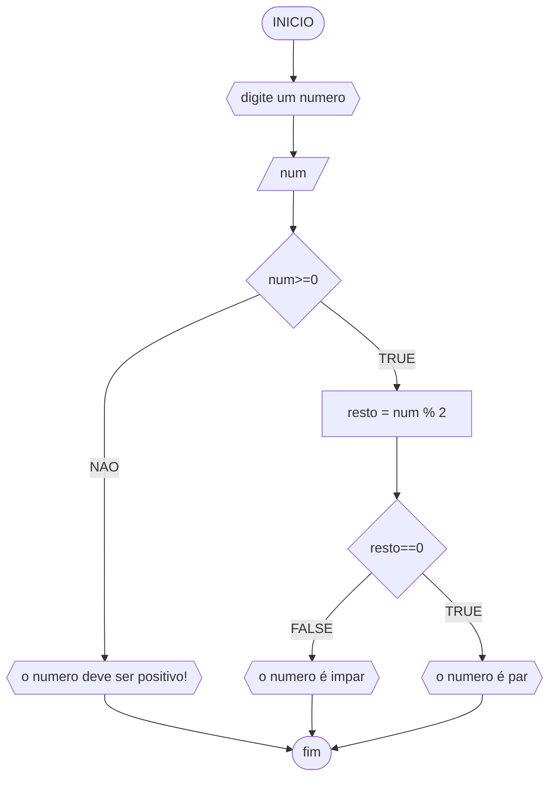

# UNIFOR
**nome**: Samuel Lima Forte <br>
**disciplina**: Raciocinio Lógico e algoritmico

## Lista de exercícios 01

### Exercício 03
represente, em fluxograma e pseudocódigo, um algoritmo para determinar se um número inteiro positivo é par ou impar

#### Fluxograma


#### PSEUDOCÓDIGO
```
ALGORITMO verifica_par_ou_impar
DECLARE num: int, resto: INTEIRO
INICIO
ESCREVA "digite um numero''
LEIA num
SE num>=0 ENTAO 
	resto <- num % 2
	SE resto==0 ENTAO 
		ESCREVA "o numero é par"
	SENAO 
		ESCREVA "numero é impar"
	FIM_SE
SENAO
	ESCREVA "esse numero não é positivo"
FIM_SE
FIM
```
#### TESTE
| num | num >= 0 | resto | resto == 0 | Saída |
| -- | -- | -- | -- | -- |
|-1| false | | | "o numero deve ser positivo" |
|0| True | 0 | True | "o numero é par" |
|10| True | 0 | True | "o numero é par"|
|11| True | 1 | False | "o numero é impar"|


